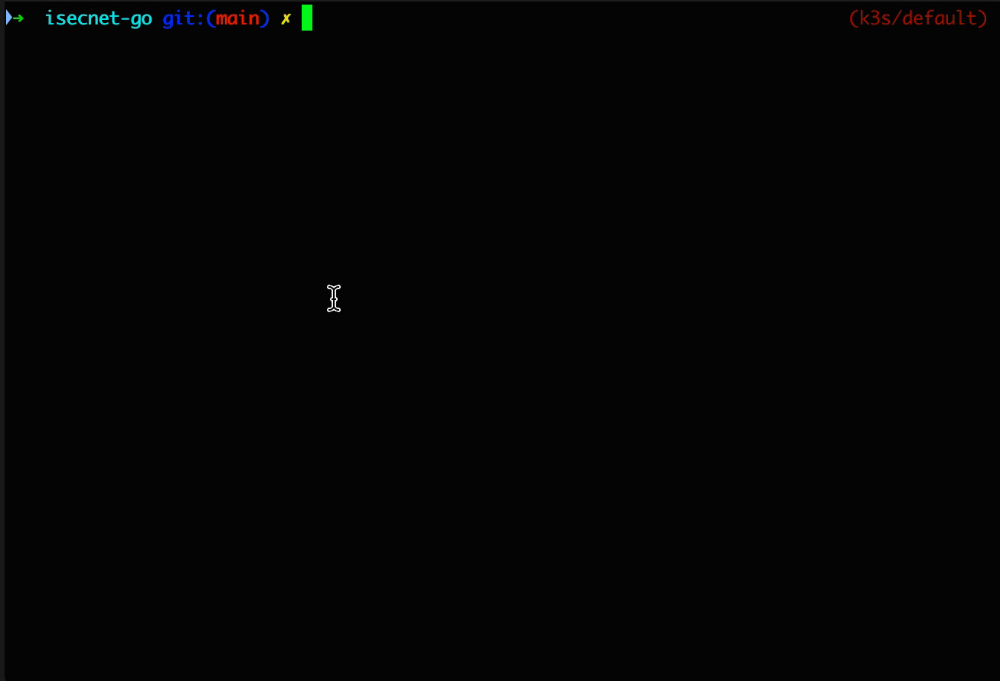

# ISECnet-go

This an go SDK implementation for Intelbras' ISECNet protocol.

## ISEcnet

ISECnet is a proprietary protocol used by Intelbras in their alarm central communication.

## Usage

### Available Commands

```
  help          Help about any command
  partialStatus Get partial central status
  zones         Get Zone status
```

### Flags

```
      --config string     config file (default is $HOME/.isecnet-go.yaml)
  -h, --help              help for isecnet-go
      --host string       Host or IP of the central (default "localhost")
      --password string   Central password (default "1234")
      --port string       Central port (default "9009")
  -t, --toggle            Help message for toggle
```

### Example


[](https://app.fossa.com/projects/git%2Bgithub.com%2Fthspinto%2Fisecnet-go?ref=badge_shield)

## Zones description

You can configure the zone description in `.isecnet-go.yaml` to see meaningful names and only zones in use. See `.isecnet-go..yaml.example` for example:

```yaml
zones:
  - id: 1
    name: Front Door
    description: Front dor magnetic sensor

```

```bash
➜  isecnet-go git:(main) ✗ go run . --password 1234 zones
Using config file: ./.isecnet-go.yaml
INFO[0000] Connecting...                                 address="localhost:9009"
+------------+----------+-------+----------+------------+--------+---------------+
|    ZONE    | ANULATED | OPEN  | VIOLATED | LOWBATTERY | TAMPER | SHORT CIRCUIT |
+------------+----------+-------+----------+------------+--------+---------------+
| Front Door | false    | false | false    | false      | false  | false         |
+------------+----------+-------+----------+------------+--------+---------------+
```

## Testing

* `make unit-test`: unit tests

* `make lint`: linter

* `make test`: run all

* `make mock-server`: starts the mock server


## Contributing

## References

* https://github.com/jrbenito/isec-wireshark
* https://github.com/felipealmeida/amt2018


## License
[](https://app.fossa.com/projects/git%2Bgithub.com%2Fthspinto%2Fisecnet-go?ref=badge_large)